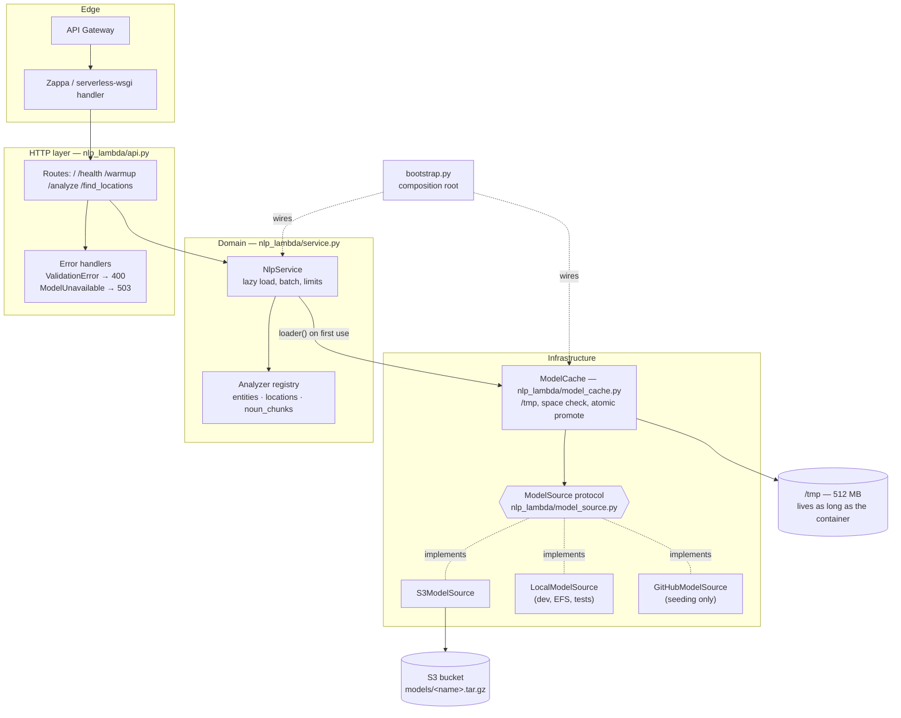
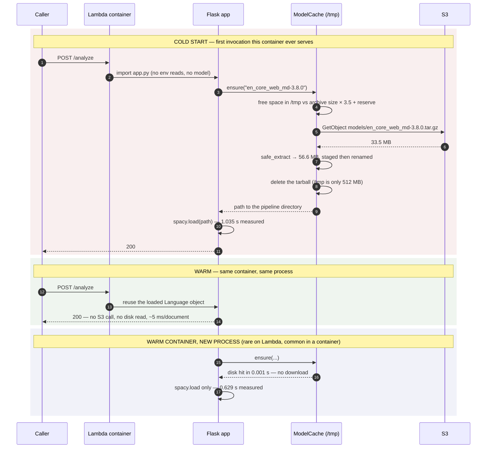

# NLP on AWS Lambda, with the model in S3

A small Flask service that runs spaCy pipelines on AWS Lambda. The spaCy model is
not in the deployment package: it lives in S3, is downloaded on the first
invocation a container serves, and is cached in `/tmp` for every invocation after
that. That one decision is the whole point of the project, because a Lambda
deployment package may not exceed **250 MB unzipped** and a useful spaCy pipeline
plus its dependencies will not fit.

The arithmetic, measured rather than assumed (see
[`docs/captured-output.md`](docs/captured-output.md) §7):

| | size |
|---|---|
| `requirements.txt` installed, without any model | ~149 MB |
| `en_core_web_md-3.8.0` unpacked | 56.6 MB |
| **total in a package** | **~206 MB against a 250 MB limit** |
| `en_core_web_lg-3.8.0`, compressed archive alone | 400.6 MB — cannot be packaged at all |

Moving the model out of the package turns a hard limit into a cold-start latency
question, which is a much better problem to have.

## Captured output

There is no UI. Everything below is real output from a run on 2026-09-24 against a
local `moto` server standing in for S3 — the full session, including the test suite
and the linter, is in [`docs/captured-output.md`](docs/captured-output.md).

A cold container: fetch from the bucket, unpack into `/tmp`, load into memory.

```console
2026-09-24 06:12:32,909 INFO nlp_lambda.model_cache model_cache miss model=en_core_web_sm-3.8.0 source=s3 seconds=0.280 bytes=15267634
2026-09-24 06:12:32,910 INFO nlp_lambda.bootstrap model_ready model=en_core_web_sm-3.8.0 cache_hit=False seconds=0.280 path=/tmp/models/en_core_web_sm-3.8.0/...
2026-09-24 06:12:33,150 INFO nlp_lambda.service pipeline_loaded name=core_web_sm seconds=1.002 components=tok2vec,tagger,parser,attribute_ruler,lemmatizer,ner
2026-09-24 06:12:33,150 INFO werkzeug 127.0.0.1 - - [24/Sep/2026 06:12:33] "POST /warmup HTTP/1.1" 200 -
```

Structured entities, with offsets so a caller can highlight the source text:

```console
$ curl -s -X POST http://127.0.0.1:8320/analyze -H 'Content-Type: application/json' \
    -d '{"text": "Ada Lovelace met Charles Babbage in London in 1843, and the Analytical Engine was never finished."}'
{
    "analyzer": "entities",
    "count": 1,
    "results": [
        [
            {"text": "Ada Lovelace",          "label": "PERSON", "start_char": 0,  "end_char": 12},
            {"text": "Charles Babbage",       "label": "PERSON", "start_char": 17, "end_char": 32},
            {"text": "London",                "label": "GPE",    "start_char": 36, "end_char": 42},
            {"text": "1843",                  "label": "DATE",   "start_char": 46, "end_char": 50},
            {"text": "the Analytical Engine", "label": "ORG",    "start_char": 56, "end_char": 77}
        ]
    ]
}
```

A batch, through the original endpoint's analyzer:

```console
$ curl -s -X POST http://127.0.0.1:8320/analyze -H 'Content-Type: application/json' \
    -d '{"texts": ["Flights from Madrid to Lisbon were cancelled; Madrid reopened first.",
                   "No place names in this sentence at all."],
         "analyzer": "locations"}'
{
    "analyzer": "locations",
    "count": 2,
    "results": [["Madrid", "Lisbon"], []]
}
```

A bad request is a 400 with a reason, not a 500:

```console
$ curl -s -X POST http://127.0.0.1:8320/analyze -H 'Content-Type: application/json' \
    -d '{"text": "hi", "analyzer": "astrology"}'
{
    "detail": "unknown analyzer 'astrology'; available: entities, locations, noun_chunks",
    "error": "bad_request"
}
```

## Architecture

Four layers, dependencies pointing inward. `service.py` — the part that does
linguistics — imports neither Flask nor boto3, which is why the whole suite runs in
seconds with no AWS credentials and no model download.



The pattern is **hexagonal / ports-and-adapters, lightly applied**: `ModelSource`
is the port, `S3ModelSource` / `LocalModelSource` / `GitHubModelSource` are the
adapters, and `bootstrap.py` is the only module that knows about all of them at
once. It is deliberately not more than that — this is a service with four routes.

## Workflow: cold start, then warm invocations

The cost that matters lands exactly once per container.



## Quickstart

### Docker (one command)

```bash
docker compose up
```

That starts MinIO as a stand-in for S3, seeds it with a real spaCy model (the API is
useless without a model in the bucket, so seeding is part of boot), and starts the
API. Then:

```bash
curl -s localhost:8320/health
curl -s -X POST localhost:8320/warmup
curl -s -X POST localhost:8320/analyze -H 'Content-Type: application/json' \
     -d '{"text": "Ada Lovelace met Charles Babbage in London in 1843."}'
```

| service | host port | what it is |
|---|---|---|
| `api` | 8320 | the Flask app, identical to what runs on Lambda |
| `minio` | 8321 | S3-compatible object store |
| `minio` console | 8322 | web console, `minioadmin` / `minioadmin` |

Tear down with `docker compose down -v`.

> The compose stack and the `Dockerfile` in this repository were authored and
> parse-checked with `docker compose config`; they have **not** been built or booted
> on the machine that last edited this README.

### Deploying to Lambda

```bash
# 1. put a model in the bucket, once
export S3_BUCKET=your-model-bucket SPACY_MODEL=en_core_web_sm-3.8.0
python -m nlp_lambda.cli download --dest /tmp/models
python -m nlp_lambda.cli upload   --dest /tmp/models

# 2. deploy the code, which does not contain the model
zappa deploy dev
```

Edit `zappa_settings.json` first: it carries the bucket names, the region and the
runtime environment variables. `keep_warm` is enabled there, which stops containers
being recycled quite so eagerly; it does not itself load the model, so call
`POST /warmup` after a deploy if you want the first user request to be fast.

## Configuration

Every variable is optional — the app boots, `/health` answers and the tests pass
with an entirely empty environment. Missing configuration is reported when it is
first needed, as a readable error, not as a `KeyError` at import time.

| name | required | default | what it does |
|---|---|---|---|
| `SPACY_MODEL` | no | `en_core_web_sm-3.8.0` | Model to serve. Must match an object in the bucket. |
| `SPACY_MODEL_MEDIUM` | no | — | Legacy alias for `SPACY_MODEL`, read only if that is unset. |
| `MODEL_SOURCE` | no | `s3` | `s3`, `local` or `github`. See *Extensibility*. |
| `S3_BUCKET` | when `MODEL_SOURCE=s3` | — | Bucket holding the model archives. |
| `S3_PREFIX` | no | `models` | Key prefix; the object is `<prefix>/<model>.tar.gz`. |
| `S3_ENDPOINT_URL` | no | — | Point boto3 at MinIO/LocalStack instead of AWS. |
| `LOCAL_MODEL_ROOT` | when `MODEL_SOURCE=local` | — | Directory containing an unpacked model. |
| `MODEL_CACHE_DIR` | no | `/tmp/models` | Where the model is unpacked. On Lambda this must be under `/tmp`. |
| `CACHE_RESERVE_BYTES` | no | `67108864` (64 MB) | Headroom left free when checking whether a download will fit. |
| `MAX_TEXT_CHARS` | no | `100000` | Longest single document accepted. |
| `MAX_BATCH_SIZE` | no | `32` | Most documents accepted in one request. |
| `SENTRY_DSN` | no | — | Enables Sentry. Omit it and error reporting is simply off. |
| `LOG_LEVEL` | no | `INFO` | Root log level. |
| `PORT` | no | `8320` | Port for `python app.py` and the container. |

Copy `.env.example` to `.env` for local development; `python-dotenv` loads it from
the entrypoints only, never from library code.

## Development

```bash
python -m venv .venv && source .venv/bin/activate
pip install -r requirements-dev.txt

pytest                       # 67 tests, no AWS and no model download
ruff check .                 # lint
ruff format --check .        # formatting
```

`pipenv` works too — the `Pipfile` was rewritten for Python 3.12 (it asked for 3.8,
which no longer resolves) and `Pipfile.lock` was regenerated on 2026-09-24:

```bash
pipenv install --dev && pipenv run pytest
```

Running the API without Docker, against a local model:

```bash
# fetch and unpack a model into /tmp/models, straight from the spaCy releases
MODEL_SOURCE=github MODEL_CACHE_DIR=/tmp/models python -m nlp_lambda.cli warm
MODEL_SOURCE=local LOCAL_MODEL_ROOT=/tmp/models ./run_local.sh
```

Useful commands:

```bash
python -m nlp_lambda.cli warm             # do exactly what a cold start does, with timings
python -m nlp_lambda.cli analyze "Madrid" --analyzer locations
python -m scripts.bench_pipeline          # measure the component-disabling win yourself
```

## Project structure

```
app.py                     WSGI entrypoint — `app` is what Zappa imports. Nine lines.
nlp_lambda/
  api.py                   Flask blueprint + app factory. Parse, validate, delegate.
  service.py               NlpService and the analyzer registry. No Flask, no AWS.
  model_source.py          ModelSource protocol + S3/local/GitHub adapters + registry.
  model_cache.py           The /tmp cache: space check, staging, atomic promote, memo.
  archive.py               Safe tar extraction and spaCy pipeline-directory discovery.
  config.py                Settings.from_env(). Everything optional, nothing at import.
  bootstrap.py             Composition root: Settings → ModelSource → Cache → Service.
  cli.py                   download / upload / warm / analyze.
  errors.py                The exception types the HTTP layer maps to status codes.
scripts/bench_pipeline.py  Reproduce the throughput numbers in this README.
tests/                     67 tests. No network, no credentials, no model.
docs/captured-output.md    Every transcript quoted here, in full.
Dockerfile                 Multi-stage, non-root, no model baked in.
docker-compose.yml         MinIO + a seeding job + the API, one command.
zappa_settings.json        Lambda deployment configuration.
```

## Design notes

### Why the model is not in the package

Lambda's 250 MB unzipped package limit is the constraint the whole design answers.
spaCy plus numpy plus thinc plus boto3 is already ~149 MB before a model exists
(measured, §7 of the captured output). `en_core_web_md` unpacked is another 56.6 MB.
That fits, with 44 MB to spare and no room to grow; `en_core_web_lg` does not fit at
any size, since its *compressed* archive is 400.6 MB on its own.

Putting the archive in S3 and fetching it at runtime removes the limit and replaces
it with two new ones, both of which the code takes seriously:

* **`/tmp` is 512 MB.** `ModelCache.check_space` compares the archive size (from an
  S3 `HeadObject`, no download) against the free space before starting, and raises
  `InsufficientSpaceError` with a sentence you can act on rather than letting
  `tarfile` die with `ENOSPC` halfway through. The tarball is deleted immediately
  after unpacking, because holding both copies is what actually blows the budget.
* **Cold starts get slower.** Which is the next section.

### Cold start, measured

All numbers below are from this machine (Apple Silicon laptop) with the S3 API
served locally by `moto` over loopback. **The download component is therefore
unrealistically fast and the CPU is faster than a small Lambda.** They are honest
about the *shape* of the cost, not its magnitude on AWS.

| phase | `en_core_web_sm` | `en_core_web_md` |
|---|---|---|
| fetch + unpack (loopback, cold `/tmp`) | 0.291 s | 0.466 s |
| `spacy.load` | 0.742 s | 1.035 s |
| first document | 0.004 s | 0.004 s |
| **cold total** | **~1.04 s** | **~1.51 s** |
| same container, new process (disk hit + load) | 0.631 s | — |
| warm invocation, same process | ~0 s (5.24 ms/document) | — |

Two things this makes clear. First, on this hardware `spacy.load` costs more than
the transfer does — so shrinking the archive is not automatically the win you would
expect; on Lambda, where the network is slower and scales with configured memory,
the balance moves the other way and you should re-measure. Second, the warm path
costs nothing at all, which is why the cache is worth its complexity.

**Measure it in your own account.** `POST /warmup` returns `load_seconds`, and the
`model_cache miss ... seconds=` log line separates transfer from load. That is
deliberately more useful than a number in a README, because the answer depends on
your region, your memory setting and your model.

### Scalability: the real bottleneck

For this service the bottleneck is not throughput, it is **per-container model
duplication**. Every concurrent Lambda execution environment holds its own copy of
the model in memory and its own copy in `/tmp`; 100 concurrent executions of a
`md`-model function is 100 × ~150 MB resident and 100 cold-start downloads. The
things that actually move the needle, in the order they are worth doing:

1. **Cache in `/tmp`, memoise in the process.** Done. Turns an N-invocations cost
   into an N-containers cost, and warm invocations do not even `stat` the disk.
2. **Disable the pipeline components the request does not need.** Done, and
   measured: over a 32-document batch, running only `ner` for the `entities`
   analyzer is **2.47× faster** than the full pipeline (414.9 ms → 167.7 ms median,
   5.24 ms/document). The parser is most of a spaCy pipeline's cost and an entity
   extractor has no use for it. Reproduce with `python -m scripts.bench_pipeline`.
3. **Batch.** `/analyze` accepts `texts` and uses `nlp.pipe`, so one invocation can
   amortise its overhead across up to `MAX_BATCH_SIZE` documents instead of paying
   API Gateway and container costs per sentence.
4. **Size memory for the model, not the CPU.** Lambda allocates CPU and network
   bandwidth in proportion to memory, so a larger memory setting can make a
   download-and-load-bound cold start *cheaper* as well as faster. Start from
   resident size — a loaded `md` pipeline is not much smaller than its 56.6 MB on
   disk — and profile upward.
5. **Keep containers alive.** `keep_warm` in `zappa_settings.json`, plus
   `POST /warmup` to prime a new one on purpose rather than on a user's request.
6. **Bound the work per request.** `MAX_TEXT_CHARS` and `MAX_BATCH_SIZE` exist so
   one caller cannot turn a 60-second Lambda timeout into a bill.

What is deliberately *not* here: no queue (the work is synchronous and
sub-10 ms warm), no cross-container cache (there is nowhere to put one that is
faster than S3), no Kubernetes. If cold starts became the dominant cost, the answer
is EFS or a container image — see the next section — not more moving parts.

Cost per cold start is one S3 `GetObject`. In-region S3-to-Lambda transfer is not
billed, so the marginal cost is the request itself; check current S3 request pricing
rather than trusting a figure written here.

### Extensibility: one seam

`ModelSource` is a one-method protocol with a registry in front of it:

```python
from nlp_lambda.model_source import register_model_source, LocalModelSource

register_model_source("efs", lambda settings: LocalModelSource(Path("/mnt/models")))
# MODEL_SOURCE=efs
```

This is the seam because it is the decision most likely to change. EFS trades money
for a cold start that skips the download entirely; a container image trades
deployment size for the same; an air-gapped deployment needs an internal artifact
store rather than S3. All of them are one class and one registry line, and nothing
above `bootstrap.py` notices.

The second, smaller seam is the analyzer registry in `service.py` — a new output
(sentiment, custom NER labels, a different language's pipeline) is a function and a
`register_analyzer` call, and it appears in `/` and `/health` automatically. An
analyzer declares which spaCy components it `requires` and which it `keeps`, which
is how the component-disabling optimisation stays correct as analyzers are added.

### Bugs found and fixed

This repository had not been audited before this pass. The substantive fixes:

* `app.py` imported `sentry_sdk` and read `os.environ['SENTRY_DSN']` at module
  scope — **the app could not start without a Sentry DSN**, and `src/nlp.py`
  downloaded a model from S3 at import time, so the test suite required AWS
  credentials to collect.
* `/debug-sentry` called `process_request_arguments`, **a function that did not
  exist anywhere in the repository**, then divided by zero and returned nothing.
  The route is gone.
* `find_locations(**json_payload)` passed every key of an untrusted request body
  straight into a Python call. A typo in a key name was a `TypeError` and a 500.
* `locations_sorted_by_num_appearances` was `list(Counter(...).keys())`, which is
  insertion order — **the ranking the name promised never happened**. It is now
  `most_common()`, with a test.
* Model paths were rebuilt with `model.split('-')[0]`, which breaks for any model
  name containing more than one hyphen. Directory discovery now looks for
  `config.cfg` (v3) or `meta.json` + `tokenizer` (v2).
* `tarfile.extractall` was called on a downloaded archive with no member
  validation — CVE-2007-4559, a tar member named `../../…` writes outside the
  destination. `archive.safe_extract` validates members and links first.
* A `serverless.yml` deploying `org: xoelop / app: noicejobs-lambda` sat alongside
  `zappa_settings.json` with a different memory size and a different name. Two
  disagreeing deployment paths is worse than one; the unused one was removed.

And one found while writing this README, which is why the captured output is worth
producing: the first version of the component-disabling optimisation kept only the
parser for `noun_chunks`, and `doc.noun_chunks` **silently returned `[]`** because
it also needs the POS tags from the tagger and attribute_ruler. Hence the `keeps`
field on `Analyzer`, and `test_disable_set_keeps_what_each_analyzer_actually_depends_on`.

## Limitations

* **It has not been deployed to AWS as part of this work.** Every timing in this
  README was measured locally against a `moto` server over loopback. The download
  phase on real Lambda will be slower and the CPU will differ; `/warmup` and the
  `model_cache` log line exist so you can measure your own.
* **The Docker image has not been built or booted** on the machine that last edited
  this README (a RAM constraint). `docker compose config` parses; that is all that
  has been verified.
* **The dependency pins moved forward.** Python 3.8 → 3.12, spaCy unpinned → `>=3.7,<4`,
  `sentry-sdk==0.16.4` → optional `>=2.0`. The old `Pipfile` could not be resolved on a
  current machine at all, and spaCy 3 cannot load the spaCy 2 models the old README
  named, so this was not optional. `Pipfile.lock` was regenerated on 2026-09-24.
* **Entities carry no confidence score.** spaCy's default NER does not expose one,
  and inventing a number would be worse than omitting it.
* **One model per deployment.** `SPACY_MODEL` is a single value; serving several
  models from one function would multiply the `/tmp` and memory footprint, and the
  512 MB ceiling makes that a decision rather than a feature.
* **No authentication.** The service assumes API Gateway (or whatever fronts it)
  handles authn/authz.
* **`/tmp` is never evicted.** The cache only ever grows, which is correct for one
  model and would need an eviction policy if that changed.
* **English pipelines only, by configuration rather than by code.** Any spaCy model
  archive works; only `en_core_web_*` has been exercised here.

## Licence

MIT — see [LICENSE](LICENSE).
